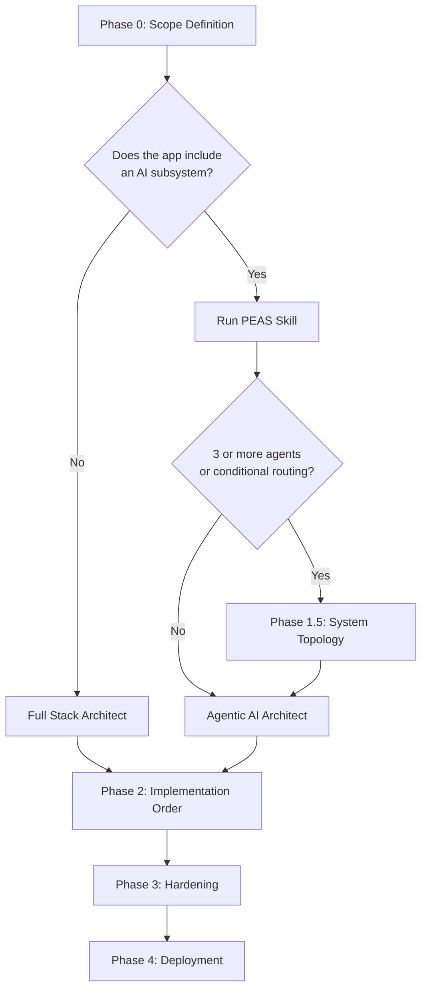

# Build Playbook

**The step-by-step sequence for building any application — agentic or not — using this repository's agents, skills, and rules.**

This document answers the question every developer asks at the start of a project: *"What do I do first?"* It is not an agent and not a skill — it is the **meta-layer** that orchestrates everything else.

- **New project:** follow the phases in order, start to finish.
- **Existing project:** jump to the phase that matches where you are.
- **AI-only system (no frontend/backend):** skip Phase 1 (Full Stack Architect) and go directly to Phase 1 → Agentic AI Architect.

---

## Overall Flow

---

## Phase 0 — Scope Definition

**Always required. No architecture conversation starts before a written spec exists.**

### Step 1 — Write the PRD

Invoke `resources/skills/product/PRD/SKILL.md`.

The PRD skill asks you discovery questions and produces a structured `tasks/prd-*.md` file that defines:
- What the application does and for whom
- Core user stories and acceptance criteria
- Out-of-scope boundaries
- Success metrics

**Output:** `tasks/prd-[project-name].md`

### Step 2 — Write the PEAS Document *(if the app includes an AI subsystem)*

Invoke `resources/skills/product/PEAS/SKILL.md`.

The PEAS skill produces a structured Agent Design Document for each AI agent in the system, covering:
- **Performance Measure** — how agent success is evaluated
- **Environment** — what data sources and tools the agent operates on
- **Actuators** — what actions the agent can take
- **Sensors** — what inputs the agent receives

**Output:** `tasks/agent-design-[agent-name].md`

> Write one PEAS document per distinct AI agent. For a system with a retrieval agent and a synthesis agent, write two PEAS documents before proceeding.

### Checkpoint

Before moving to Phase 1, you must have:
- [ ] A completed PRD in `tasks/`
- [ ] A PEAS document in `tasks/` for each AI agent (if applicable)

---

## Phase 1 — Architecture Design

Choose the right architect based on what you are building:

| Scenario | Architect to invoke |
|---|---|
| Full-stack web app (frontend + backend), no AI | `resources/agents/architects/fullstack_architect.md` |
| AI system only (no frontend/backend) | `resources/agents/architects/agentic_ai_architect.md` |
| Full-stack app **with** an AI subsystem | Full Stack Architect first — it hands off to Agentic AI Architect via the delegation map |

### Full Stack Architect

The Full Stack Architect runs a 3-gate discovery process (Application Shape → Data & Business Logic → Infrastructure) before proposing any architecture. It:
1. Detects the existing tech stack (or derives it from your answers).
2. Presents a stack proposal and waits for approval.
3. Scaffolds the initial directory structure.
4. Emits a **dependency-ordered Delegation Map** assigning each area of the codebase to a role agent.

**Output:** approved blueprint, directory scaffold, `docker-compose.yml`, `.env.example`, Delegation Map.

### Agentic AI Architect

The Agentic AI Architect checks for your PEAS document first (Gate 0). If one exists, it reads the Derived Recommendations and skips directly to pattern selection. It then presents an architecture for one of five AI branches:

| Branch | Pattern |
|---|---|
| A — Knowledge Retrieval / RAG | Standard RAG, CRAG, or ReAct (default for multi-document) |
| B — Multi-Agent Workflow | CrewAI, AutoGen, SmolAgents, or LangGraph StateGraph |
| C — Document / Vision / Multimodal | Claude Vision, GPT-4o, or multimodal parsing pipeline |
| D — Domain-Specific AI (Financial) | Financial RAG with optional multimodal layer |
| E — Data Synthesis | Seeded generation pipeline or adversarial red-team data |

**Output:** approved architecture proposal with selected framework, components, and data flow.

---

## Phase 1.5 — System Topology *(complex AI systems only)*

**Trigger this phase when the system has 3 or more agents, or when agents communicate conditionally (branching, loops, retries).**

The Agentic AI Architect handles single-branch systems well on its own. But profound, multi-agent systems require an additional design step before writing any code.

### 1. Sketch the Agent Graph

Draw (or describe) the agent topology before selecting a framework:

| Topology | When to use it | Framework |
|---|---|---|
| **Pipeline** (A → B → C) | Sequential, no branching | LangChain LCEL |
| **DAG** (A → B and C in parallel, then D) | Fan-out / fan-in | LangGraph StateGraph |
| **State machine** (conditional routing, loops, retries) | Complex business logic with error handling | LangGraph StateGraph |
| **Role-based crew** (manager + specialists) | Well-defined role boundaries | CrewAI |
| **Consensus group** (agents debate, vote, or critique) | Evaluation, red-teaming, or multi-perspective analysis | AutoGen |

### 2. Define Agent Contracts

For every edge in the agent graph, define before writing any code:

- **What Agent A outputs:** format, schema, and confidence signal
- **What Agent B expects as input:** required fields, assumptions
- **What happens on failure:** empty result, low-confidence signal, or exception

Without contracts, agent-to-agent integration is the #1 source of runtime failures in complex systems.

### 3. Identify Human-in-the-Loop Checkpoints

Mark the nodes in your agent graph where a human must approve the output before the system proceeds. LangGraph's `interrupt` mechanism handles this natively. Insert checkpoints at:
- High-stakes decisions (executing a trade, sending a communication, deleting data)
- Low-confidence agent outputs below a defined threshold
- Any point where the cost of a wrong answer exceeds the cost of a pause

### 4. Set Up Observability Before Writing Agent Code

Do not write a single agent call before instrumentation is in place. Connect LangSmith or Langfuse to your project before the first run. Without traces, debugging a 4-agent system is effectively impossible.

What observability gives you per agent call:
- Exact input received
- Exact output returned
- Tool calls made and their results
- Latency and token cost

### 5. Define the Evaluation Strategy

Specify which `llm_judge.md` rubric dimensions apply to each agent's output, and whether you will use the RAG evaluation rule (`resources/rules/evaluation/rag-evaluation.mdc`) or the EDD rule (`resources/rules/evaluation/edd-evaluation.mdc`).

---

## Phase 2 — Implementation Order

**Always implement in dependency order.** Building out of order is the leading cause of expensive rewrites.

| Order | Agent | Skill Files Loaded | Why this position |
|---|---|---|---|
| 1 | `database_agent.md` | `database/migrations.md`, `database/vector_dbs.md` | Schema is the foundation. Everything else depends on it. Changing it after backend or frontend work triggers cascading rewrites. |
| 2 | `backend_agent.md` (+ Auth) | `backend/fastapi_architecture.md`, `backend/supabase_rls.md` | API endpoints require a stable schema. Authentication must exist before any protected route is built. |
| 3 | `frontend_agent.md` | `frontend/react_patterns.md`, `frontend/sanity_cms.md` | Depends on the agreed API contract from the blueprint. Starting before the backend is ready causes frontend drift. |
| 4 | `payment_agent.md` *(conditional)* | `payments/stripe.md`, `payments/mercadopago.md` | Depends on stable backend routes. Payment webhooks must land on working endpoints. |
| 5 | `agentic_ai_architect.md` *(conditional)* | Selected AI skill files | The AI subsystem integrates with the backend API. Building it after the backend is stable avoids mock-to-real API migration pain. |
| 6 | `devops_agent.md` | `devops/docker_best_practices.md` | Scaffold `docker-compose.yml` early (the Full Stack Architect does this), but finalize production Dockerfiles and CI/CD workflows after the app runs cleanly on localhost. |

### Cross-Cutting Rules (enforced throughout)

These rules apply across all agents and all phases. No agent may violate them:

- **API contract before frontend.** The endpoint list from the blueprint is the contract. Frontend and backend must agree on it before either side begins implementation. Do not let the endpoints drift during development.
- **CORS declared in the blueprint.** The allowed origins list is set in the architecture phase. CORS misconfiguration is the #1 cross-cutting bug in full-stack projects.
- **All environment variables declared before implementation.** Every variable used by any agent must appear in `.env.example` before any agent begins coding. No agent invents new env vars without updating the blueprint.
- **No secrets in code.** API keys, passwords, and credentials live in `.env` files (git-ignored), never in source.

---

## Phase 3 — Hardening

**Run after all features are implemented. Do not run the QA or Security agents on incomplete code — they will flag incomplete implementations as bugs.**

### QA Agent

Invoke `resources/agents/roles/qa_agent.md`.

The QA Agent loads skills based on the detected stack and performs:
- Test suite execution (Pytest for Python, Jest for Node/TypeScript)
- Static type checking (MyPy)
- Linting and formatter compliance (Ruff)
- Coverage reporting

Skill files: `qa/testing_pytest.md`, `qa/testing_jest.md`, `qa/static_analysis_mypy.md`, `qa/linting_ruff.md`

### Security Agent

Invoke `resources/agents/roles/security_agent.md`.

The Security Agent performs a final cross-cutting audit:
- **SAST** (static application security testing) — `security/sast.md`
- **Secrets scanning** — `security/secrets_scanning.md`
- **Dependency audit** — `security/dependency_audit.md`
- **CORS and HTTP headers review** — verifies the blueprint's CORS config was implemented correctly

### LLM Judge *(for AI subsystems)*

Invoke `resources/agents/reviewers/llm_judge.md`.

The LLM Judge evaluates agent outputs against a 10-point rubric covering skill adherence, output quality, evaluation coverage, and more. Run it against the AI subsystem's outputs using the test cases defined in the evaluation strategy (Phase 1.5, Step 5).

---

## Phase 4 — Deployment

Invoke `resources/agents/roles/devops_agent.md` for the final deployment configuration.

At this stage the DevOps Agent finalizes:
- **Production Dockerfile** — multi-stage build, non-root user, minimal image
- **CI/CD workflows** (GitHub Actions) — lint, test, build, deploy pipeline
- **Environment-specific configs** — staging vs production env separation
- **Health checks and readiness probes** — for container orchestration

Skill file: `devops/docker_best_practices.md`

---

## Quick Reference — Agent × Phase Map

| Agent | File | Phase |
|---|---|---|
| PRD Skill | `resources/skills/product/PRD/SKILL.md` | Phase 0 |
| PEAS Skill | `resources/skills/product/PEAS/SKILL.md` | Phase 0 |
| Full Stack Architect | `resources/agents/architects/fullstack_architect.md` | Phase 1 |
| Agentic AI Architect | `resources/agents/architects/agentic_ai_architect.md` | Phase 1 / Phase 1.5 |
| Database Agent | `resources/agents/roles/database_agent.md` | Phase 2 — Step 1 |
| Backend Agent | `resources/agents/roles/backend_agent.md` | Phase 2 — Step 2 |
| Frontend Agent | `resources/agents/roles/frontend_agent.md` | Phase 2 — Step 3 |
| Payment Agent | `resources/agents/roles/payment_agent.md` | Phase 2 — Step 4 (conditional) |
| DevOps Agent | `resources/agents/roles/devops_agent.md` | Phase 2 — Step 6 + Phase 4 |
| QA Agent | `resources/agents/roles/qa_agent.md` | Phase 3 |
| Security Agent | `resources/agents/roles/security_agent.md` | Phase 3 |
| LLM Judge | `resources/agents/reviewers/llm_judge.md` | Phase 3 (AI subsystems) |
| Feature Tracker | `resources/agents/reviewers/feature-tracker.md` | Any — maps codebase against PRD |
