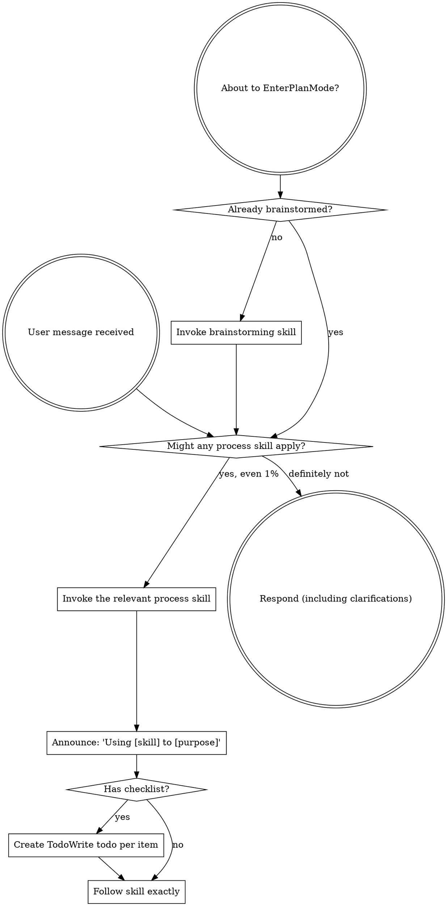

> **Note:** This bucket replaces the upstream entry-point skill from the vendored plugin. The methodology is the same; the namespace is `skills/shared/process/`. (See attribution at bottom.)

<SUBAGENT-STOP>
If you were dispatched as a subagent to execute a specific task, skip this skill.
</SUBAGENT-STOP>

<EXTREMELY-IMPORTANT>
If you think there is even a 1% chance a process skill might apply to what you are doing, you ABSOLUTELY MUST invoke the relevant process skill.

IF A PROCESS SKILL APPLIES TO YOUR TASK, YOU DO NOT HAVE A CHOICE. YOU MUST USE IT.

This is not negotiable. This is not optional. You cannot rationalize your way out of this.
</EXTREMELY-IMPORTANT>

## Instruction Priority

Process skills override default system prompt behavior, but **user instructions always take precedence**:

1. **User's explicit instructions** (CLAUDE.md, GEMINI.md, AGENTS.md, direct requests) — highest priority
2. **Process skills** — override default system behavior where they conflict
3. **Default system prompt** — lowest priority

If AGENTS.md says "don't use TDD" and a process skill says "always use TDD," follow the user's instructions. The user is in control.

## How to Access Process Skills

All process skills live under `skills/shared/process/`. Each has its own `SKILL.md`.

**In Claude Code:** Use the `Skill` tool. When you invoke a process skill, its content is loaded and presented to you — follow it directly. Never use the Read tool on skill files.

**In Copilot CLI:** Use the `skill` tool. Skills are auto-discovered from installed plugins. The `skill` tool works the same as Claude Code's skill invocation.

**In Gemini CLI:** Skills activate via the `activate_skill` tool. Gemini loads skill metadata at session start and activates the full content on demand.

**In other environments:** Check your platform's documentation for how skills are loaded.

## Platform Adaptation

Process skills use Claude Code tool names. Non-CC platforms:
- Copilot CLI — see `references/copilot-tools.md` for tool equivalents.
- Codex — see `references/codex-tools.md` for tool equivalents.
- Gemini CLI — tool mapping is loaded automatically via GEMINI.md.

# Using Process Skills

## The Rule

**Invoke the relevant process skill BEFORE any response or action.** Even a 1% chance a process skill might apply means you should invoke it to check. If an invoked process skill turns out to be wrong for the situation, you don't need to follow it.

## Red Flags

These thoughts mean STOP — you're rationalizing:

| Thought | Reality |
|---------|---------|
| "This is just a simple question" | Questions are tasks. Check for process skills. |
| "I need more context first" | Process skill check comes BEFORE clarifying questions. |
| "Let me explore the codebase first" | Process skills tell you HOW to explore. Check first. |
| "I can check git/files quickly" | Files lack conversation context. Check for process skills. |
| "Let me gather information first" | Process skills tell you HOW to gather information. |
| "This doesn't need a formal skill" | If a process skill exists, use it. |
| "I remember this skill" | Skills evolve. Read current version. |
| "This doesn't count as a task" | Action = task. Check for process skills. |
| "The skill is overkill" | Simple things become complex. Use it. |
| "I'll just do this one thing first" | Check BEFORE doing anything. |
| "This feels productive" | Undisciplined action wastes time. Process skills prevent this. |
| "I know what that means" | Knowing the concept ≠ using the skill. Invoke it. |

## Skill Priority

When multiple process skills could apply, use this order:

1. **Process skills first** ([skills/shared/process/brainstorming/SKILL.md], [skills/shared/process/systematic-debugging/SKILL.md]) — these determine HOW to approach the task
2. **Implementation skills second** (frontend-design, mcp-builder) — these guide execution

"Let's build X" → [skills/shared/process/brainstorming/SKILL.md] first, then implementation skills.
"Fix this bug" → [skills/shared/process/systematic-debugging/SKILL.md] first, then domain-specific skills.

## Skill Types

**Rigid** ([skills/shared/process/test-driven-development/SKILL.md], [skills/shared/process/systematic-debugging/SKILL.md]): Follow exactly. Don't adapt away discipline.

**Flexible** (patterns): Adapt principles to context.

The skill itself tells you which type it is.

## User Instructions

Instructions say WHAT, not HOW. "Add X" or "Fix Y" doesn't mean skip workflows.

## Self-Correction

If a process skill is recurrently skipped or misapplied, log the pattern in `context/tasks/self-correction.md` per AGENTS.md §3.

---

*Adapted from obra/superpowers — see `docs/process/CREDITS.md`.*
